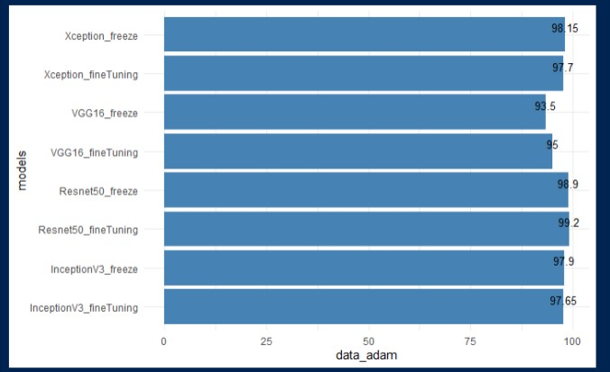
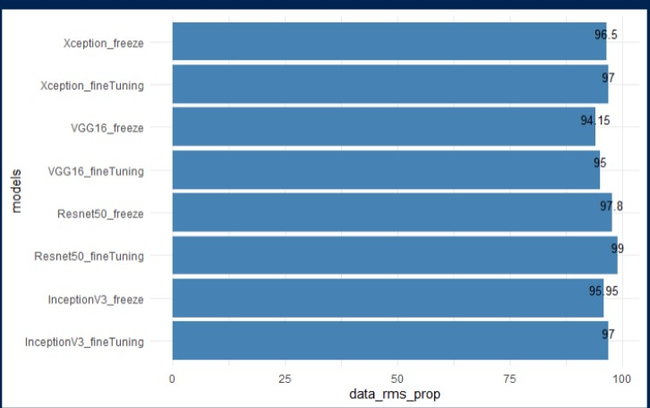

# Data-analytics-project-2

This is project I have worked on for my Essentials of Data Analytics Project. In this, using R programming. I have developed models to check whether a person is wearing mask or not.
 
<h2>Data Pre-Processing</h2>
Using R programming, I have divided my dataset into Train, Test and Validation. Afterwards, I have used Image Processing concepts to convert images into grayscale and reducing them to
standard size of (150, 150, 1).

<h2>Model Implementations</h2>
I have worked on this before as well, but here I have used concepts of Deep Learning and used Pre-trained models to develop the model. I have used ImageNet for transfer learning.
I have used following optimizers in the code:
<ul>
  <li>adam Optimizer</li>
  <li>rms prop Optimizer</li>
</ul>
Following pre-trained models have been implemented:
<ul>
  <li>VGG16</li>
  <li>ResNet50</li>
  <li>InceptionV3</li>
  <li>Xception</li>
</ul>
To know more about the models, <a href="R Code and Results/">Click Here</a>
<h2>Results</h2>
Models developed with Adam Optimizer:

Models developed with Rms_prop Optimizer:

